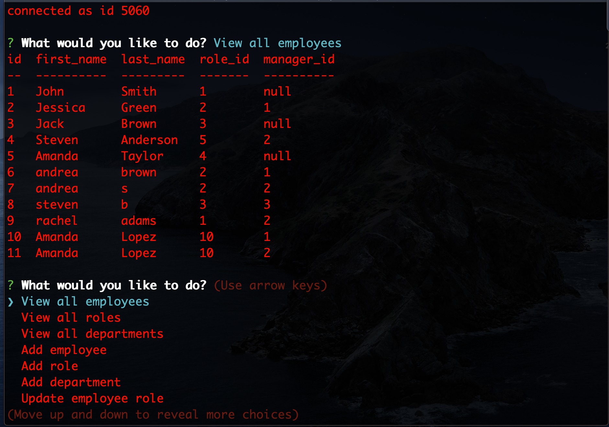

# employee-tracker 
## Directions: 
This app will allow employers to add/view roles, departments, and employees through the command line. Employers will be able to see employees names, salaries, position and id's. Employers can select from a list of options and will go through a series of prompts. 

Video Link:
https://drive.google.com/file/d/10fM7HKffxdA2AZQ-WXg0I3iTx-Cge9vu/view?usp=sharing 

